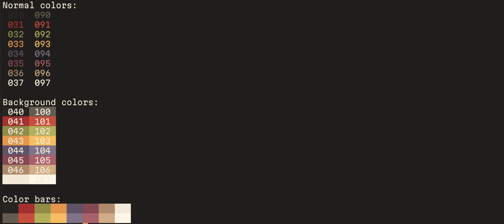
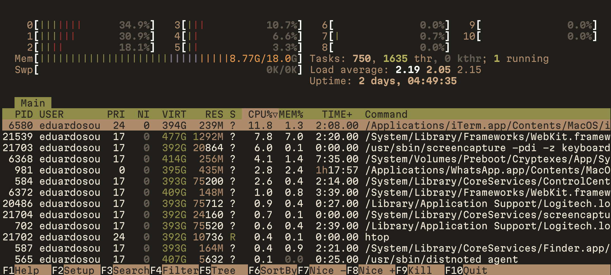
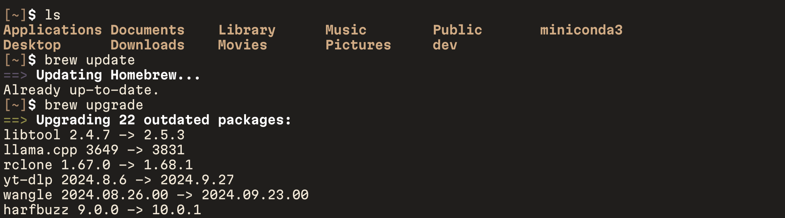

# Autumn Breeze iTerm Color Scheme

Autumn Breeze is a warm, cozy color scheme for iTerm2 inspired by the rich hues of fall. This theme offers a comfortable viewing experience with carefully chosen colors that evoke the feeling of crisp autumn days while maintaining excellent readability.

## Features

- Warm, autumn-inspired color palette
- High contrast for improved readability
- Carefully selected colors based on Pantone references
- Soothing on the eyes for long coding sessions

## Preview

## Installation

1. Download the `AutumnBreeze.itermcolors` file from this repository.
2. Open iTerm2.
3. Go to `iTerm2 > Preferences > Profiles > Colors`.
4. Click on `Color Presets...` at the bottom right.
5. Select `Import...` from the dropdown menu.
6. Choose the downloaded `AutumnBreeze.itermcolors` file.
7. Select "Autumn Breeze" from the `Color Presets...` dropdown to apply the theme.

## Color Palette

The Autumn Breeze theme uses the following color palette:

- Background: Deep charcoal (inspired by Pantone 419 C)
- Foreground: Warm ivory
- Accent colors:
  - Reds: Autumn leaf red (inspired by Pantone 18-1550 TCX Ketchup)
  - Greens: Antique moss (inspired by Pantone 17-0840 TCX Antique Moss)
  - Yellows/Oranges: Golden orange (inspired by Pantone 15-1050 TCX Golden Orange)
  - Blues: Muted slate (inspired by Pantone 18-3917 TCX Grisaille)
  - Purples: Berry tones (inspired by Pantone 19-2428 TCX Pickled Beet)
  - Browns: Warm ginger (inspired by Pantone 18-1048 TCX Glazed Ginger)

## Customization

Feel free to tweak the colors to your liking. You can modify the `AutumnBreeze.itermcolors` file using a text editor or iTerm's built-in color editor.

## Contributing

Contributions are welcome! If you have suggestions for improvements or bug fixes, please open an issue or submit a pull request.

## License

This color scheme is released under the MIT License. See the [LICENSE](LICENSE) file for details.

## Acknowledgements

- Inspired by the beautiful colors of autumn
- Color selections inspired by Pantone color references

Enjoy your cozy coding sessions with Autumn Breeze!
